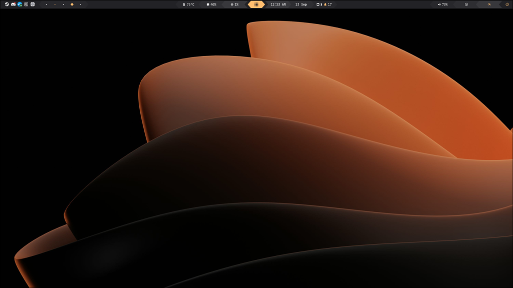
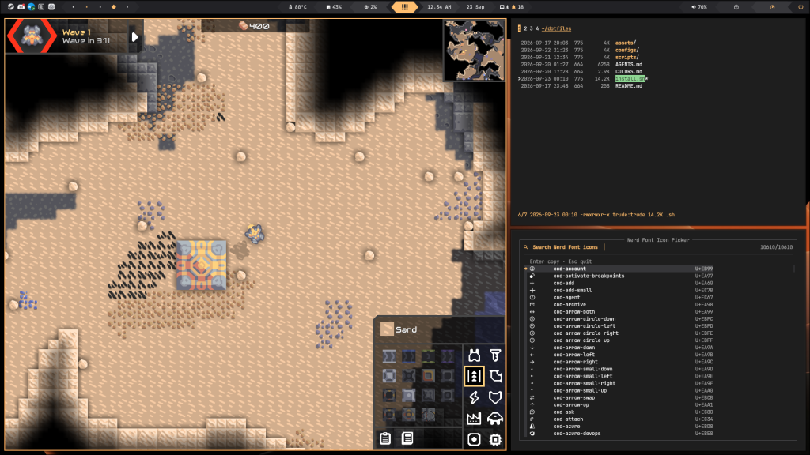
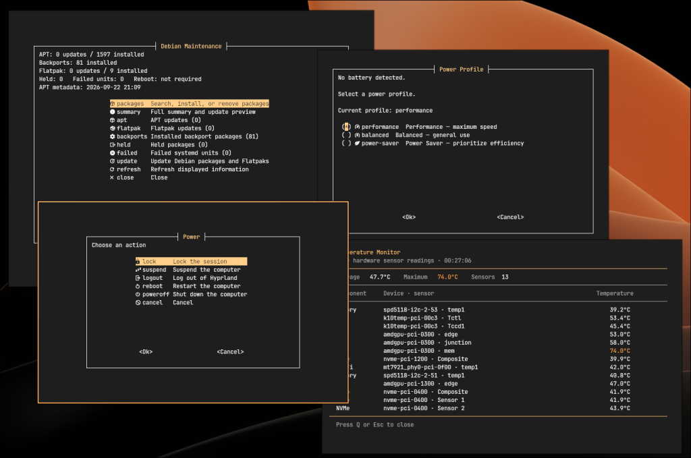
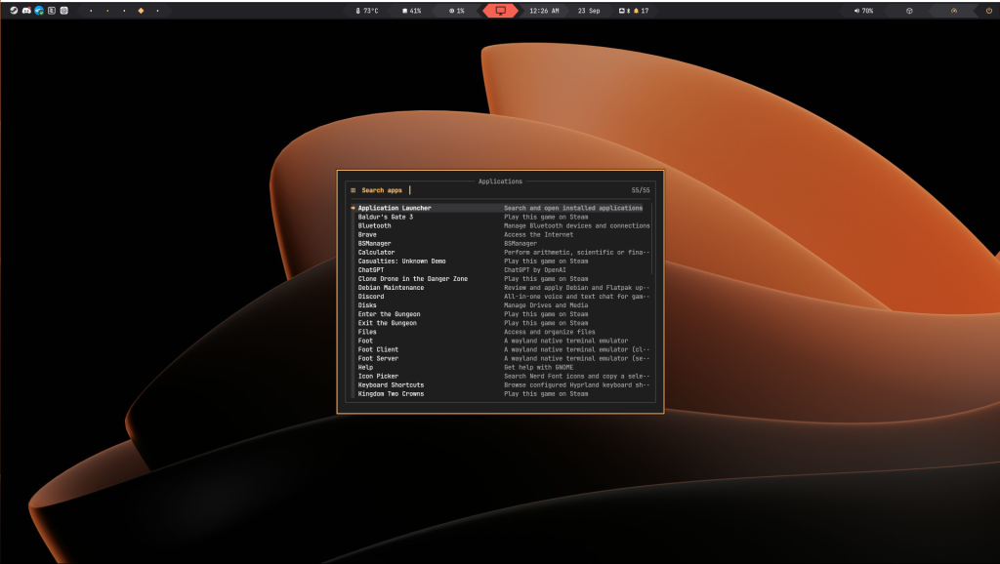
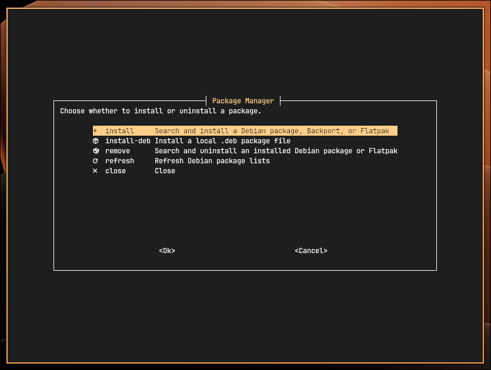
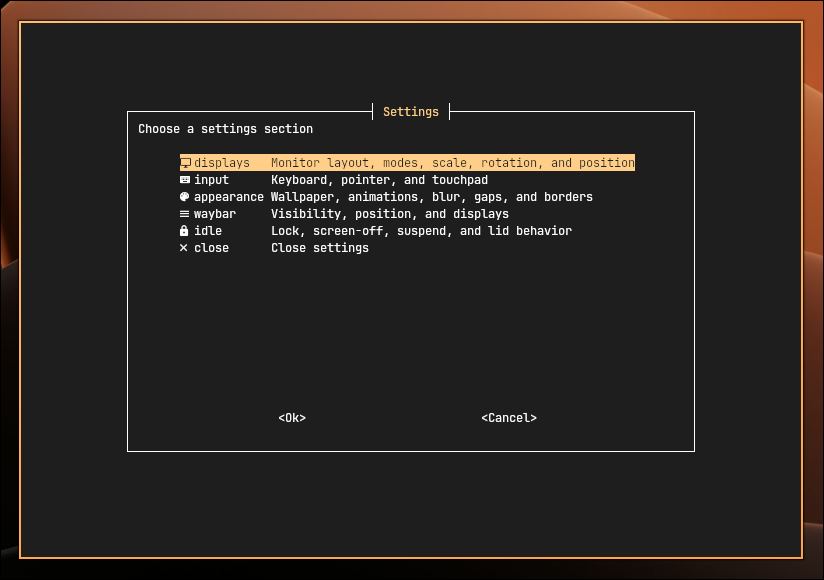

# TruDE

**Trude’s Desktop Environment** is an optimized, keyboard-driven Debian desktop built around Hyprland.

**Under 200 MB RAM at idle · Everything is a TUI**

<p align="center">
  
  
</p>

## TUIs for every setting

Instead of keeping a separate applet open for every task, TruDE opens compact terminal interfaces when you need them. The menus and helper scripts are designed to appear immediately and close when you’re done.

The included tools cover package management, system maintenance, app launching, Bluetooth, networking, power profiles, notifications, file browsing, system monitoring, temperatures, and more.

| Terminal tools | Application launcher |
| --- | --- |
|  |  |

## APT, Backports and Flatpacks

TruDE configures Debian Backports and Flathub. You can easily install, uninstall and update packages, and be notified when updates are needed.


## Customize the desktop from one panel

Easily configure your system without manually editing configuration files. Adjust display layout, keyboard and touchpad behavior, wallpaper, animations, blur, gaps, borders, Waybar, and idle timeouts. Press `Super+I` to open it; `Super` opens the launcher.



## User-friendly features

TruDE is meant for power users and is mainly keyboard-driven, but most interfaces also support mouse navigation and communicate the state of the desktop intuitively.

You can access a list of shortcuts with `Super+H` or by launching the `Shortcuts` app, or know whether you are sharing your screen with an indicator. System maintenance is made easy with an update counter and simple update menu.

| Customizable Icon | Screen sharing |
| --- | --- |
|  |  |

## Installation

The installer supports **Debian 13 (Trixie) and newer Debian releases**. From a regular user shell with `curl` installed, paste:

```sh
curl -fsSL https://raw.githubusercontent.com/TrudeEH/TruDE/master/bootstrap.sh | sh
```

The bootstrap installs Git, clones TruDE into `$HOME/dotfiles`, and runs the installer. When it finishes, log out and back in to start the TruDE session.
